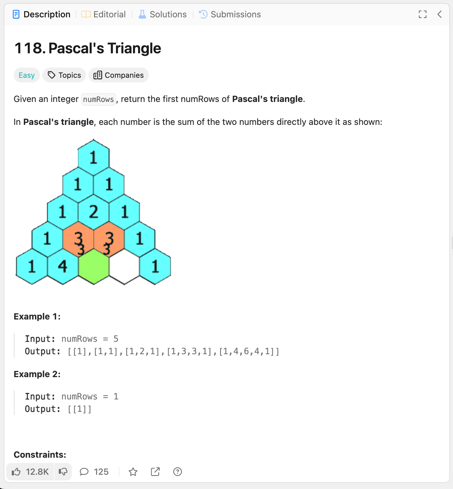

118. Pascal's Triangle

link: https://leetcode.com/problems/pascals-triangle

정수 numRows가 주어지면, 파스칼 삼각형의 처음 numRows를 반환하세요.

파스칼 삼각형에서 각 숫자는 바로 위에 있는 두 숫자의 합입니다.

예제 1:

입력: numRows = 5
출력: [[1],[1,1],[1,2,1],[1,3,3,1],[1,4,6,4,1]]
예제 2:
[1,a-1,a-1,1] - a=4
[1,a,2a-2,a,1]
[1,a+1,3a-2,3a-2,a+1,1]
[1,a+2,4a-4,6a-6,4a-4,a+2,1]
[1,a+3,5a-6,10a-10,10a-10,5a-6,a+3,1]
[1,a+4,6a-8,15a-20,20a-20,15a-20,6a-8,a+4,1]
[1,a+5,7a-10,21a-30,35a-40,35a-30,21a-30,7a-10,a+5,1]
[1,a+6,8a-12,28a-50,56a-70,70a-70,56a-70,28a-50,8a-12,a+6,1]
[1,a+7,9a-14,36a-84,84a-126,126a-126,84a-126,36a-84,9a-14,a+7,1]
[1,a+8,10a-16,45a-120,120a-210,210a-252,252a-252,210a-252,120a-210,45a-120,10a-16,a+8,1]
[1,a+9,11a-18,55a-165,165a-330,330a-462,462a-462,330a-462,165a-330,55a-165,11a-18,a+9,1]
[1,a+10,12a-20,66a-220,220a-495,495a-792,792a-924,924a-924,792a-924,495a-792,220a-495,66a-220,12a-20,a+10,1]
[1,a+11,13a-22,78a-286,286a-715,715a-1287,1287a-1716,1716a-1716,1287a-1716,715a-1287,286a-715,78a-286,13a-22,a+11,1]

[1]
[1,1]
[1,2,1]
[1,3,3,1]
[1,4,6,4,1]
[1,5,10,10,5,1]
[1,6,15,20,15,6,1]
[1,7,21,35,35,21,7,1]
[1,8,28,56,70,56,28,8,1]
[1,9,36,84,126,126,84,36,9,1]
[1,10,45,120,210,252,210,120,45,10,1]
[1,11,55,165,330,462,462,330,165,55,11,1]
[1,12,66,220,495,792,924,792,495,220,66,12,1]
[1,13,78,286,715,1287,1716,1716,1287,715,286,78,13,1]
[1,14,91,364,1001,2002,3003,3432,3003,2002,1001,364,91,14,1]
[1,15,105,455,1365,3003,5005,6435,6435,5005,3003,1365,455,105,15,1]
[1,16,120,560,1820,4368,8008,11440,12870,11440,8008,4368,1820,560,120,16,1]
[1,17,136,680,2380,6188,12376,19448,24310,24310,19448,12376,6188,2380,680,136,17,1]
[1,18,153,816,3060,8568,18564,31824,43758,48620,43758,31824,18564,8568,3060,816,153,18,1]
[1,19,171,969,3876,11628,27132,50388,75582,92378,92378,75582,50388,27132,11628,3876,969,171,19,1]

입력: numRows = 1
출력: [[1]]

제약사항:

1 <= numRows <= 30
