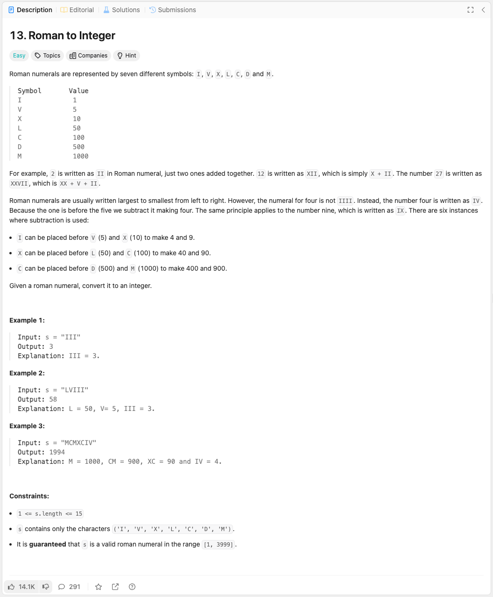

link: https://leetcode.com/problems/roman-to-integer/

로마 숫자는 일곱 가지 다른 기호로 표현됩니다: I, V, X, L, C, D, M.

기호         값
I             1
V             5
X             10
L             50
C             100
D             500
M             1000

예를 들어, 2는 로마 숫자로 II라고 쓰며, 이는 단순히 1이 두 번 더해진 것입니다. 12는 XII라고 쓰며, 이는 단순히 X + II입니다. 숫자 27은 XXVII로 쓰며, 이는 XX + V + II입니다.

로마 숫자는 보통 왼쪽에서 오른쪽으로 큰 숫자부터 작은 숫자 순서로 씁니다. 그러나 숫자 4는 IIII가 아니라 IV라고 씁니다. 이는 1이 5 앞에 있기 때문에 빼서 4를 만드는 것입니다. 같은 원리가 숫자 9에도 적용되어 IX라고 씁니다. 뺄셈이 사용되는 경우는 여섯 가지가 있습니다:

- I는 V (5)와 X (10) 앞에 올 수 있어 4와 9를 만듭니다.
- X는 L (50)과 C (100) 앞에 올 수 있어 40과 90을 만듭니다.
- C는 D (500)와 M (1000) 앞에 올 수 있어 400과 900을 만듭니다.

주어진 로마 숫자를 정수로 변환하세요.

### 예시 1:

입력: s = "III"

출력: 3

설명: III = 3.

### 예시 2:

입력: s = "LVIII"

출력: 58

설명: L = 50, V = 5, III = 3.

### 예시 3:

입력: s = "MCMXCIV"

출력: 1994

설명: M = 1000, CM = 900, XC = 90, IV = 4.

### 제약 조건:

- 1 <= s.length <= 15
- s는 ('I', 'V', 'X', 'L', 'C', 'D', 'M') 문자들로만 구성됩니다.
- s는 [1, 3999] 범위 내의 유효한 로마 숫자임이 보장됩니다.
