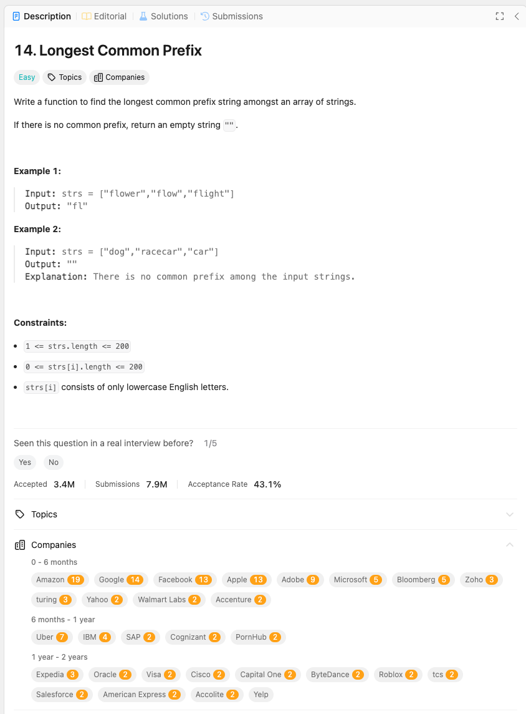

link: https://leetcode.com/problems/longest-common-prefix/description/

문자열 배열에서 가장 긴 공통 접두사를 찾는 함수를 작성하세요.

공통 접두사가 없으면 빈 문자열 ““을 반환하세요.

예제 1:

입력: strs = [“flower”, “flow”, “flight”]
출력: “fl”

예제 2:

입력: strs = [“dog”, “racecar”, “car”]
출력: “”
설명: 입력 문자열들 사이에 공통 접두사가 없습니다.

제약 조건:

1 <= strs.length <= 200
0 <= strs[i].length <= 200
strs[i]는 소문자 영어 문자로만 구성되어 있습니다.
