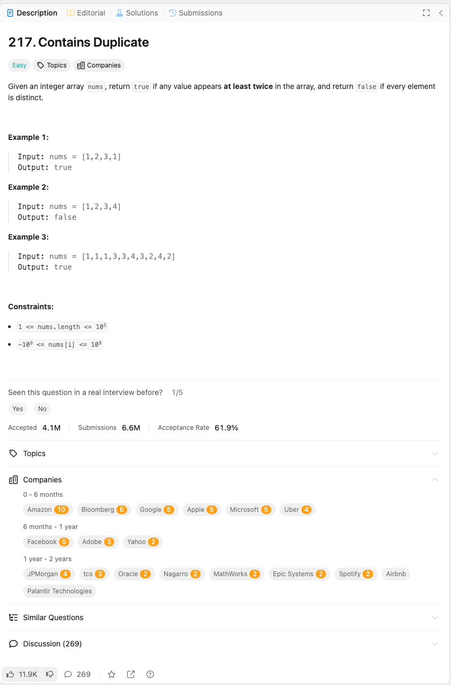

link: https://leetcode.com/problems/contains-duplicate/description/

정수 배열 nums가 주어질 때, 배열 내의 어떤 값이 적어도 두 번 이상 나타나면 true를 반환하고, 모든 요소가 서로 다르면 false를 반환하세요.

예제 1:

입력: nums = [1,2,3,1]
출력: true

예제 2:

입력: nums = [1,2,3,4]
출력: false

예제 3:

입력: nums = [1,1,1,3,3,4,3,2,4,2]
출력: true

제약 조건:

	•	nums의 길이는 1 이상 105 이하입니다.
	•	nums[i]의 값은 -109 이상 109 이하입니다.
