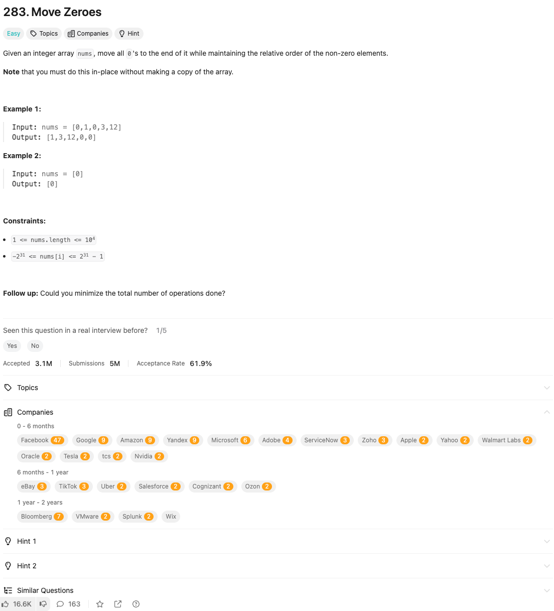

link: https://leetcode.com/problems/move-zeroes/description/

주어진 정수 배열에서 0을 모두 배열의 끝으로 이동시키고, 0이 아닌 요소의 상대적인 순서는 유지하세요. 배열을 복사하지 않고 제자리에서 이 작업을 수행해야 합니다.

**예시 1**:
- 입력: `nums = [0,1,0,3,12]`
- 출력: `[1,3,12,0,0]`

**예시 2**:
- 입력: `nums = [0]`
- 출력: `[0]`

**제약 조건**:
- 배열의 길이는 1 이상 10,000 이하입니다.
- 배열의 요소는 -2³¹ 이상 2³¹ - 1 이하입니다.

**추가 과제**: 작업의 총 횟수를 최소화할 수 있나요?
