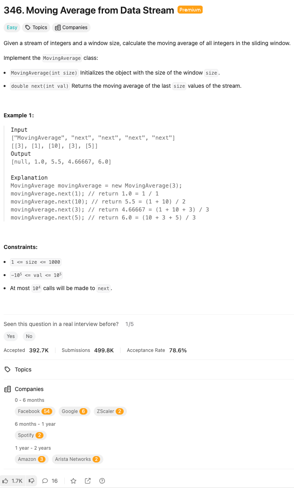

link: https://leetcode.com/problems/moving-average-from-data-stream



정수 스트림과 윈도우 크기가 주어졌을 때, 슬라이딩 윈도우 내 모든 정수의 이동 평균을 계산하세요.

`MovingAverage` 클래스를 구현하세요:

- `MovingAverage(int size)`는 윈도우 크기로 객체를 초기화합니다.
- `double next(int val)`은 스트림의 마지막 `size` 값의 이동 평균을 반환합니다.

예시 1:

입력
```
["MovingAverage", "next", "next", "next", "next"]
[[3], [1], [10], [3], [5]]
```
출력
```
[null, 1.0, 5.5, 4.66667, 6.0]
```

설명
```python
MovingAverage movingAverage = new MovingAverage(3);
movingAverage.next(1); // 반환값 1.0 = 1 / 1
movingAverage.next(10); // 반환값 5.5 = (1 + 10) / 2
movingAverage.next(3); // 반환값 4.66667 = (1 + 10 + 3) / 3
movingAverage.next(5); // 반환값 6.0 = (10 + 3 + 5) / 3
```

제약 사항:

- 1 <= size <= 1000
- -10^5 <= val <= 10^5
- `next`는 최대 10^4번 호출됩니다.
