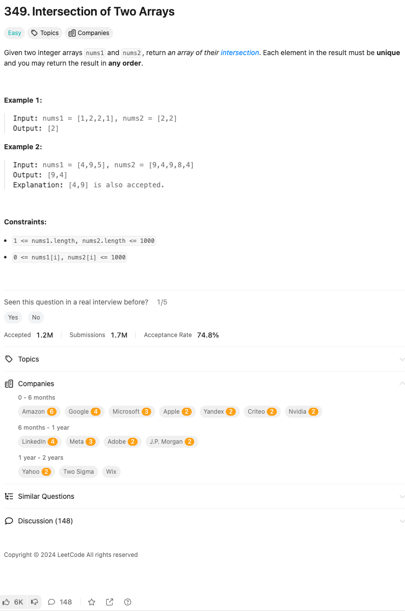

link: https://leetcode.com/problems/intersection-of-two-arrays

두 개의 정수 배열 nums1과 nums2가 주어졌을 때, 이들의 교집합 배열을 반환하세요. 결과 배열의 각 요소는 고유해야 하며, 결과는 아무 순서로 반환해도 됩니다.

예시 1:

입력: nums1 = [1,2,2,1], nums2 = [2,2]
출력: [2]

예시 2:

입력: nums1 = [4,9,5], nums2 = [9,4,9,8,4]
출력: [9,4]
설명: [4,9]도 가능합니다.

제약 조건:

	•	1 <= nums1.length, nums2.length <= 1000
	•	0 <= nums1[i], nums2[i] <= 1000
