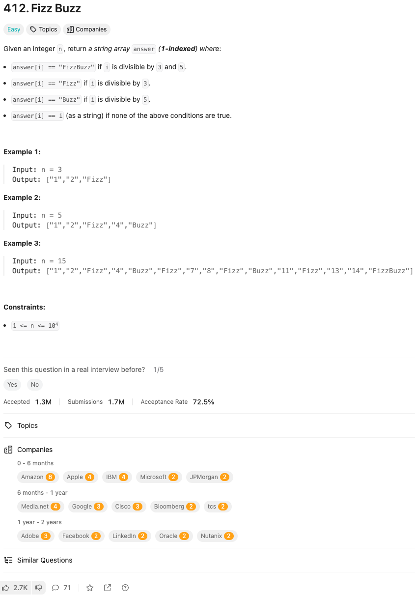

link: https://leetcode.com/problems/fizz-buzz/

정수 n이 주어졌을 때, 다음 조건에 따라 문자열 배열 answer(1부터 시작하는 인덱스)를 반환하세요:

- answer[i] == "FizzBuzz"는 i가 3과 5로 나누어 떨어질 때.
- answer[i] == "Fizz"는 i가 3으로 나누어 떨어질 때.
- answer[i] == "Buzz"는 i가 5로 나누어 떨어질 때.
- 위 조건에 해당하지 않으면 answer[i] == i (문자열 형태).

예시 1:

입력: n = 3
출력: ["1", "2", "Fizz"]

예시 2:

입력: n = 5
출력: ["1", "2", "Fizz", "4", "Buzz"]

예시 3:

입력: n = 15
출력: ["1", "2", "Fizz", "4", "Buzz", "Fizz", "7", "8", "Fizz", "Buzz", "11", "Fizz", "13", "14", "FizzBuzz"]

제약 사항:

1 <= n <= 104
