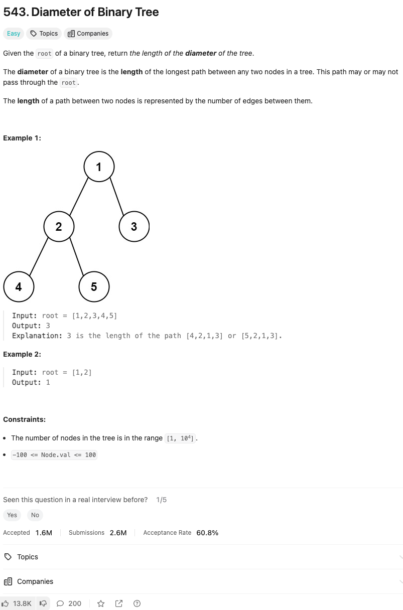

link: https://leetcode.com/problems/diameter-of-binary-tree



주어진 이진 트리의 루트 노드를 기준으로 트리의 지름의 길이를 반환하세요.

이진 트리의 지름은 트리에서 임의의 두 노드 간의 가장 긴 경로의 길이를 의미합니다. 이 경로는 루트를 지날 수도 있고 지나지 않을 수도 있습니다.

두 노드 간의 경로 길이는 그들 사이의 간선(edge)의 수로 나타냅니다.

### 예시 1:

```plaintext
입력: root = [1,2,3,4,5]
출력: 3
설명: [4,2,1,3] 또는 [5,2,1,3] 경로의 길이는 3입니다.
```

### 예시 2:

```plaintext
입력: root = [1,2]
출력: 1
```

### 제약 사항:

- 트리의 노드 개수는 [1, 10^4] 범위에 있습니다.
- -100 <= Node.val <= 100
