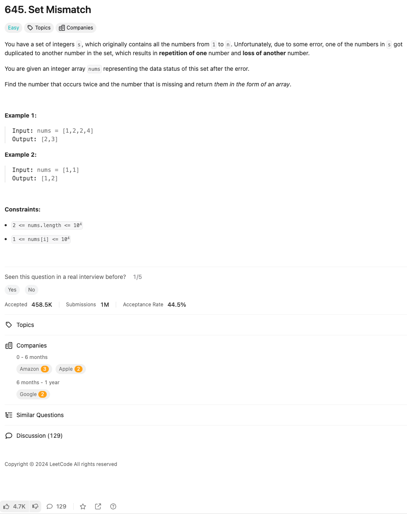

link: https://leetcode.com/problems/set-mismatch/

정수 집합 s가 주어지며, 이 집합에는 원래 1부터 n까지의 모든 숫자가 포함되어 있습니다. 불행히도 어떤 오류로 인해 s의 숫자 중 하나가 중복되어 집합의 다른 숫자가 사라지게 되었습니다.
정수 배열 nums가 주어지며, 이는 오류 후의 집합 상태를 나타냅니다.
중복된 숫자와 사라진 숫자를 찾아 배열 형태로 반환하세요.

예시 1:

입력: nums = [1,2,2,4]
출력: [2,3]
예시 2:

입력: nums = [1,1]
출력: [1,2]

제약 사항:

2 <= nums.length <= 104
1 <= nums[i] <= 104
