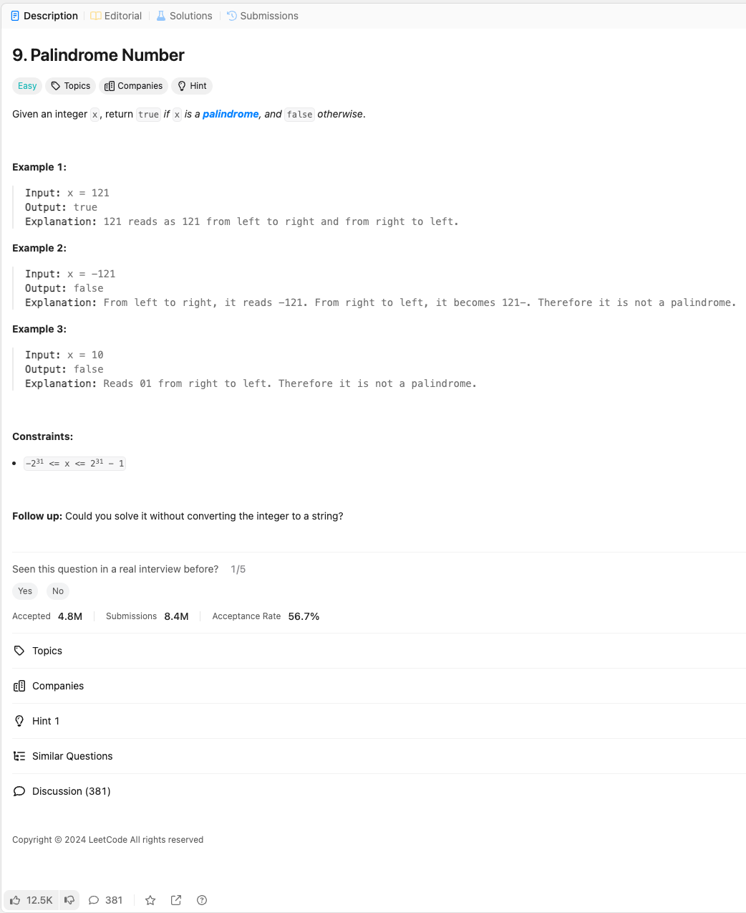

link: https://leetcode.com/problems/palindrome-number/description/

주어진 정수 x가 회문인지 확인하여 true를 반환하고, 그렇지 않으면 false를 반환하세요.

예제 1:

입력: x = 121
출력: true
설명: 121은 왼쪽에서 오른쪽으로 읽어도, 오른쪽에서 왼쪽으로 읽어도 121입니다.

예제 2:

입력: x = -121
출력: false
설명: 왼쪽에서 오른쪽으로 읽으면 -121입니다. 오른쪽에서 왼쪽으로 읽으면 121-가 되므로, 회문이 아닙니다.

예제 3:

입력: x = 10
출력: false
설명: 오른쪽에서 왼쪽으로 읽으면 01이 됩니다. 따라서 회문이 아닙니다.

제약 조건:

-2^31 <= x <= 2^31 - 1

추가 과제: 정수를 문자열로 변환하지 않고 해결할 수 있나요?
