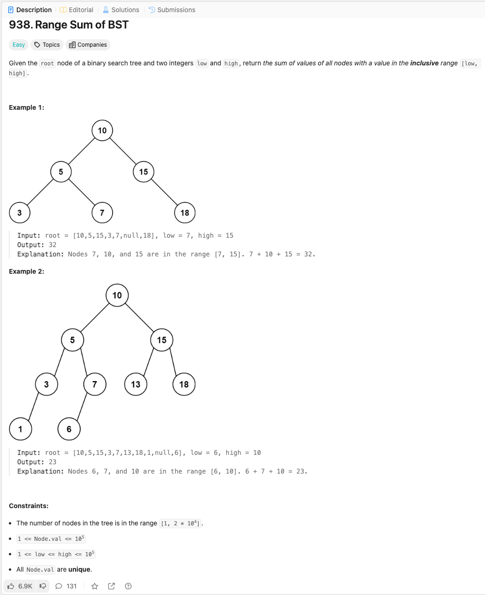

link: https://leetcode.com/problems/range-sum-of-bst 

이진 탐색 트리의 루트 노드와 두 정수 low와 high가 주어졌을 때, 값이 [low, high] 범위에 포함된 모든 노드의 값을 합산하여 반환하세요.

예제 1:

입력: root = [10,5,15,3,7,null,18], low = 7, high = 15
출력: 32
설명: 노드 7, 10, 15가 [7, 15] 범위에 포함됩니다. 7 + 10 + 15 = 32입니다.

예제 2:

입력: root = [10,5,15,3,7,13,18,1,null,6], low = 6, high = 10
출력: 23
설명: 노드 6, 7, 10이 [6, 10] 범위에 포함됩니다. 6 + 7 + 10 = 23입니다.

제약 조건:

트리의 노드 수는 [1, 2 * 10^4] 범위에 있습니다.
1 <= Node.val <= 10^5
1 <= low <= high <= 10^5
모든 Node.val은 고유합니다.
